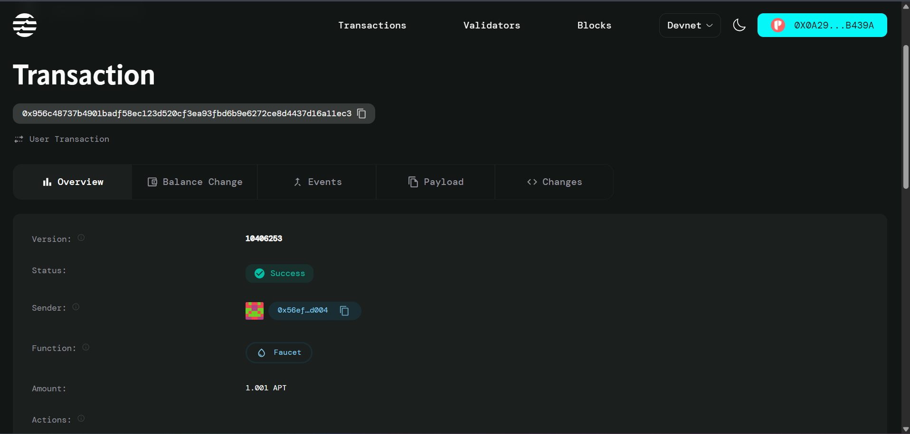

[Readme.md](https://github.com/user-attachments/files/21663436/Readme.md)
# Subscription Management Smart Contract

## Project Description

A decentralized subscription management system built on the Aptos blockchain that enables automated recurring payments between subscribers and service providers. This smart contract eliminates the need for traditional payment processors and provides a transparent, secure, and efficient way to handle subscription-based services in the Web3 ecosystem.

## Project Vision

To revolutionize subscription-based business models by leveraging blockchain technology to create a trustless, automated, and globally accessible payment infrastructure. Our vision is to empower both service providers and consumers with complete control over their subscription agreements while reducing fees, increasing transparency, and eliminating intermediaries.

## Key Features

### 🔄 **Automated Recurring Payments**
- Smart contract-based automation for subscription cycles
- Eliminates manual payment processing and reduces administrative overhead
- Ensures timely payments without human intervention

### 🛡️ **Decentralized Security**
- Built on Aptos blockchain for maximum security and transparency
- No single point of failure or centralized control
- Immutable subscription agreements stored on-chain

### 💰 **Cost-Effective Solution**
- Reduced transaction fees compared to traditional payment processors
- No intermediary fees or hidden charges
- Direct peer-to-peer transactions between subscribers and service providers

### ⚡ **Flexible Subscription Cycles**
- Customizable payment intervals (daily, weekly, monthly, yearly)
- Dynamic subscription amount adjustments
- Real-time subscription status tracking

### 🌍 **Global Accessibility**
- Cross-border payments without traditional banking limitations
- 24/7 availability regardless of geographic location
- Multi-currency support through various coin types

## Future Scope

### 📈 **Advanced Features**
- **Grace Period Management**: Implement configurable grace periods for failed payments
- **Subscription Tiers**: Multi-tier subscription plans with different features and pricing
- **Auto-renewal Options**: Smart contract-based automatic renewal with user consent
- **Payment Reminders**: On-chain notification system for upcoming payments

### 🔧 **Technical Enhancements**
- **Oracle Integration**: Real-time price feeds for stable coin conversions
- **Governance Token**: Community-driven decision making for protocol upgrades
- **Analytics Dashboard**: Comprehensive subscription analytics and reporting
- **Mobile SDK**: Easy integration for mobile applications

### 🌐 **Ecosystem Expansion**
- **Cross-chain Compatibility**: Support for multiple blockchain networks
- **DeFi Integration**: Yield farming on subscription funds
- **NFT Subscriptions**: Subscription-based access to exclusive NFT content
- **DAO Integration**: Decentralized governance for subscription protocols

### 🎯 **Business Applications**
- **SaaS Platforms**: Software-as-a-Service subscription management
- **Content Creators**: Subscription-based content monetization
- **Digital Services**: Online service provider payment automation
- **Membership Programs**: Exclusive club and community access management

## Contract Details

0x956c48737b4901badf58ec123d520cf3ea93fbd6b9e6272ce8d4437d16a11ec3

